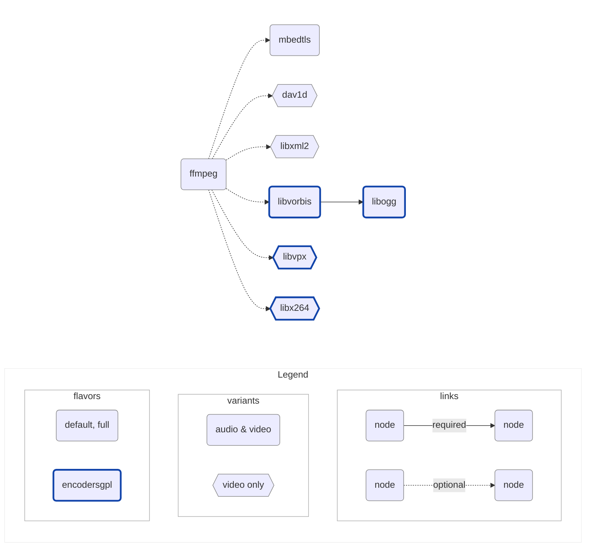

# ffmpeg build

Provides builds of [ffmpeg](https://ffmpeg.org/) for macOS & iOS,
used by [Melodink](https://github.com/gungun974/Melodink), compatible
with commercial use for playback, and GPL use for encoding.

Heavily inspired by [Media-kit](https://github.com/media-kit/libmpv-darwin-build)

## Usage

```shell
$ brew install cmake golang meson ninja
$ VERSION=v0.0.1 make
$ ls build/output
ffmpeg-libs_v0.0.1_ios-arm64-audio-default.tar.gz
ffmpeg-libs_v0.0.1_ios-arm64-audio-full.tar.gz
ffmpeg-libs_v0.0.1_ios-arm64-audio-encodersgpl.tar.gz
ffmpeg-libs_v0.0.1_ios-arm64-video-default.tar.gz
ffmpeg-libs_v0.0.1_ios-arm64-video-full.tar.gz
ffmpeg-libs_v0.0.1_ios-arm64-video-encodersgpl.tar.gz
ffmpeg-libs_v0.0.1_iossimulator-universal-audio-default.tar.gz
ffmpeg-libs_v0.0.1_iossimulator-universal-audio-full.tar.gz
ffmpeg-libs_v0.0.1_iossimulator-universal-audio-encodersgpl.tar.gz
ffmpeg-libs_v0.0.1_iossimulator-universal-video-default.tar.gz
ffmpeg-libs_v0.0.1_iossimulator-universal-video-full.tar.gz
ffmpeg-libs_v0.0.1_iossimulator-universal-video-encodersgpl.tar.gz
ffmpeg-libs_v0.0.1_macos-universal-audio-default.tar.gz
ffmpeg-libs_v0.0.1_macos-universal-audio-full.tar.gz
ffmpeg-libs_v0.0.1_macos-universal-audio-encodersgpl.tar.gz
ffmpeg-libs_v0.0.1_macos-universal-video-default.tar.gz
ffmpeg-libs_v0.0.1_macos-universal-video-full.tar.gz
ffmpeg-libs_v0.0.1_macos-universal-video-encodersgpl.tar.gz
ffmpeg-xcframeworks_v0.0.1_ios-universal-audio-default.tar.gz
ffmpeg-xcframeworks_v0.0.1_ios-universal-audio-full.tar.gz
ffmpeg-xcframeworks_v0.0.1_ios-universal-audio-encodersgpl.tar.gz
ffmpeg-xcframeworks_v0.0.1_ios-universal-video-default.tar.gz
ffmpeg-xcframeworks_v0.0.1_ios-universal-video-full.tar.gz
ffmpeg-xcframeworks_v0.0.1_ios-universal-video-encodersgpl.tar.gz
ffmpeg-xcframeworks_v0.0.1_macos-universal-audio-default.tar.gz
ffmpeg-xcframeworks_v0.0.1_macos-universal-audio-full.tar.gz
ffmpeg-xcframeworks_v0.0.1_macos-universal-audio-encodersgpl.tar.gz
ffmpeg-xcframeworks_v0.0.1_macos-universal-video-default.tar.gz
ffmpeg-xcframeworks_v0.0.1_macos-universal-video-full.tar.gz
ffmpeg-xcframeworks_v0.0.1_macos-universal-video-encodersgpl.tar.gz
```

## Naming convention

```
ffmpeg-<format>_<version>_<os>-<arch>-<variant>-<flavor>.tar.gz
```

| Component   | Notes                           | Value                      |
| ----------- | ------------------------------- | -------------------------- |
| **format**  | Output format of built files    | libs, xcframeworks         |
| **version** | Semantic version                | v0.0.1, …                  |
| **os**      | Operating system                | ios, iossimulator, macos   |
| **arch**    | Architecture                    | arm64, amd64, universal    |
| **variant** | Usage context                   | audio, video               |
| **flavor**  | Available decoders and encoders | default, full, encodersgpl |

Inclusion:

- Variants: $audio \subset video$
- Flavors: $audio \subset full \subset encodersgpl$

## Minimum versions

<table>
  <thead>
    <tr>
      <th>Platform</th>
      <th>Arch</th>
      <th>Min Version</th>
      <th>Notes</th>
    </tr>
  </thead>
  <tbody>
    <tr>
      <td rowspan="2"><strong>macOS</strong></td>
      <td>amd64</td>
      <td rowspan="2"><code>10.9</code></td>
      <td rowspan="2">Required by <code>uchardet</code></td>
    </tr>
    <tr>
      <td>arm64</td>
    </tr>
    <tr>
      <td><strong>iOS</strong></td>
      <td>arm64</td>
      <td><code>9.0</code></td>
      <td>Required by <code>ffmpeg</code></td>
    </tr>
    <tr>
      <td rowspan="2"><strong>iOS Simulator</strong></td>
      <td>amd64</td>
      <td><code>9.0</code></td>
      <td>Required by <code>ffmpeg</code></td>
    </tr>
    <tr>
      <td>arm64</td>
      <td><code>12.0</code></td>
      <td>Required by <code>xcodebuild -create-xcframework</code></td>
    </tr>
  </tbody>
</table>

## Dependencies



- [**ffmpeg**](https://ffmpeg.org): A cross-platform solution for converting,
  streaming, and recording audio and video, with support for a wide range of
  codecs and formats

- [**dav1d**](https://code.videolan.org/videolan/dav1d): A library for
  cross-platform AV1 decoding

- [**libogg**](https://github.com/xiph/ogg): Reference implementation of the Ogg
  media container

- [**libvorbis**](https://github.com/xiph/vorbis): Reference implementation of
  the Ogg Vorbis audio format

- [**libvpx**](https://gitlab.freedesktop.org/gstreamer/meson-ports/libvpx):
  Reference implementation of the VP8 and VP9 video formats

- [**libx264**](https://www.videolan.org/developers/x264.html): Free software
  library for encoding video streams into the H.264/MPEG-4 AVC compression
  format

- [**mbedtls**](https://www.libressl.org/): An open source, portable, easy to
  use, readable and flexible TLS library

- [**libxml2**](http://xmlsoft.org/): A library for processing XML data, used by
  ffmpeg to support the Dash protocol

## Commercial use

### Default, Full flavors

| Dependency | Licence                                                | Commercial use |
| ---------- | ------------------------------------------------------ | :------------: |
| ffmpeg     | LGPL-2.1 (`--enable-gpl` & `--enable-nonfree` omitted) |       ✅       |
| mbedtls    | Apache 2.0                                             |       ✅       |
| libxml2    | MIT                                                    |       ✅       |
| dav1d      | BSD-2-clause                                           |       ✅       |

### Encoders-GPL flavor

| Dependency  | Licence                              | Commercial use |
| ----------- | ------------------------------------ | :------------: |
| ffmpeg      | GPL-2.1 (`--enable-nonfree` omitted) |       ❌       |
| mbedtls     | Apache 2.0                           |       ✅       |
| libxml2     | MIT                                  |       ✅       |
| dav1d       | BSD-2-clause                         |       ✅       |
| libx264     | GPL-2.0+                             |       ❌       |
| libvpx      | BSD-3-clause                         |       ✅       |
| libvorbis   | BSD-3-clause                         |       ✅       |
| libogg      | BSD-3-clause                         |       ✅       |

## Notes

- We use `meson` as much as possible in order to simplify cross-compilation, at
  the cost of some heaviness regarding legacy packages

- If the build freezes, reboot macOS

- Command to visualize the workflow of a Makefile:

  ```
  $ make -Bnd | make2graph | dot -Grankdir=LR -Tpng -o graph.png
  ```

## Project layout

```
.
├── ...
├── cmd                                   # golang scripts
├── pkg                                   # golang packages
├── downloads.lock                        # lock file of dependencies archives
├── Makefile                              # main build script
├── scripts                               # build scripts
├── cross-files                           # cross build files used by meson
├── build
│   ├── intermediate                      # intermediate build artifacts
│   │   ├── tool-versions.lock            # versions of tools used during build
│   │   ├── downloads                     # dependencies archives files
│   │   ├── links                         # symbolic links to host binaries
│   │   ├── <rule>_<os>-<arch>-<variant>
│   │   └── ...
│   ├── tmp
│   │   ├── <rule>_<os>-<arch>-<variant>
│   │   └── ...
│   └── output
│       ├── debug.zip                     # zip containing locks and logs
│       ├── ffmpeg-<format>_<version>_<os>-<arch>-<variant>.tar.gz
│       └── ...
└── ...
```

## Resources

- https://github.com/media-kit/ffmpeg-darwin-build
- https://github.com/stps/mpv-ios-scripts
- https://github.com/iina/homebrew-mpv-iina
- https://github.com/mpv-android/mpv-android
- https://github.com/jnozsc/mpv-nightly-build
- https://github.com/smplayer-dev/mpv
- https://github.com/smplayer-dev/smplayer
- https://github.com/ldwardx/mpv-build-mac-iOS
- https://github.com/birros/godot_tl/tree/ca2fc4151bd8141241151dd6e29768608600473a/toolchains
- https://github.com/Vargol/ffmpeg-apple-arm64-build
- https://github.com/arthenica/ffmpeg-kit
